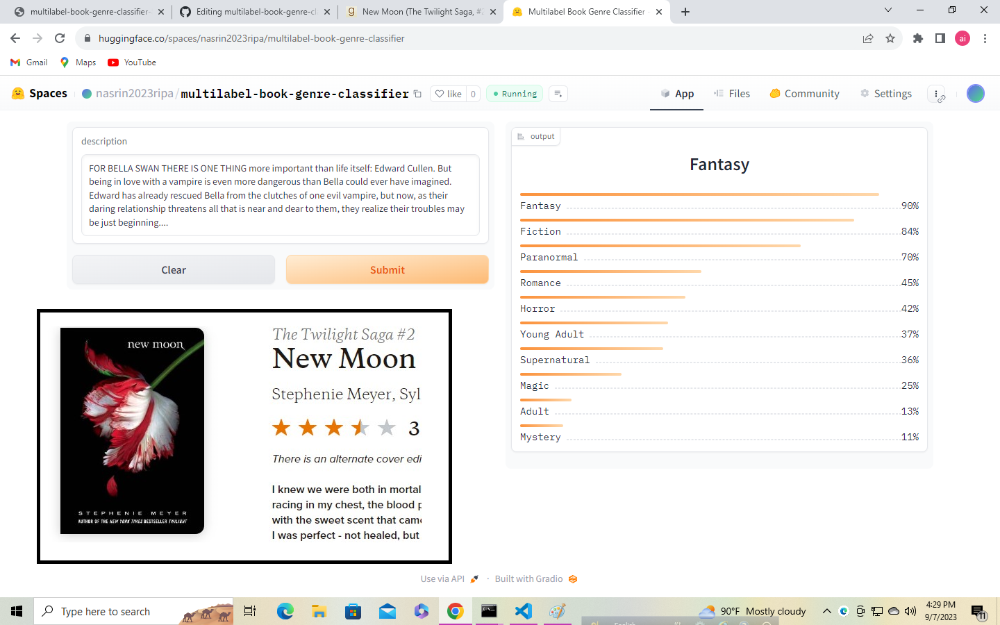
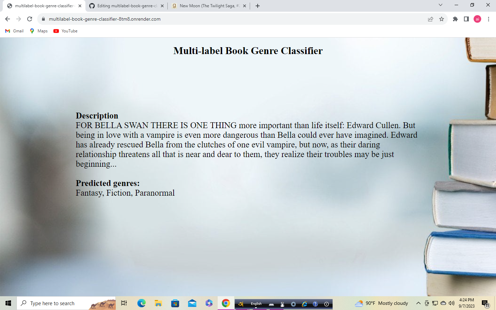

# Multilabel Book Genre Classifier 📖📚

Welcome to the Multilabel Book Genre Classifier repository! This project encompasses a comprehensive text classification model pipeline, including data collection, model training, deployment, and user-friendly web interfaces for predicting book genres based on input descriptions.

## Introduction

The main objective of this project is to develop a robust text classification model capable of associating 222 distinct book genres. The keys within the `deployment/genre_types_encoded.json` provide insights into the top 10 genres for each book.

## Data Collection and Preprocessing

The primary dataset was sourced from the esteemed website [Smashwords](https://www.smashwords.com). The data collection phase involved three key steps:

1. **Book URL Scraping:** Book URLs were systematically gathered using the `scraper/smashbook_title_urls.py` script. The URLs, along with their corresponding book titles, were stored in `scraper/smashbook_urls_1001.csv` and `scraper/smashbook_urls_2001.csv`.

2. **Book Details Scraping:** Leveraging the acquired URLs, comprehensive book descriptions and genres were extracted using the `scraper/smashbook_details.py` script. The collected data was then saved in `scraper/smashbook_details1.csv` and `scraper/smashbook_details_2.csv`.

3. **Data Integration:** The two CSV files, namely `smashbook_details1.csv` and `smashbook_details_2.csv`, were intelligently merged using the Python script in `scraper/joining.py`. An innovative data cleaning process was executed, resulting in the identification of multilabel genres for each book title with the resulting data stored in `scraper/book-details.csv`.

In total, over 27K (data file size: 44.5MB) meticulously curated book details were collected.

## Model Training

The model training phase revolved around fine-tuning a `distilroberta-base` model from the HuggingFace Transformers library, utilizing the Fastai and Blurr frameworks. A detailed account of this process is provided in the notebooks folder.

## Model Compression and ONNX Inference

The resultant trained model had a substantial memory footprint. To address this concern, the ONNX quantization technique was employed to compress the model's memory usage to a modest 80MB. The process is provided in the notebooks folder.

## Model Performance and Evaluation:
* Accuracy: around 99%
* F1 Score (Micro) = 0.6852673699527101
* F1 Score (Macro) = 0.5252153455771923

## Model Deployment

The compressed model is seamlessly accessible through the HuggingFace Spaces Gradio App. Detailed implementation can be found in the `models` folder or can be accessed directly via this [HuggingFace Spaces Link](https://huggingface.co/spaces/nasrin2023ripa/multilabel-book-genre-classifier).

## Web Deployment

An intuitive Flask application was meticulously developed, allowing users to input book descriptions and genres to receive recommended book-cover colors as output. The live application can be accessed through this [link](https://multilabel-book-genre-classifier-8tm8.onrender.com/).

## Acknowledgments

Heartfelt gratitude is extended to Mohammad Sabik Irbaz and MasterCourse Bangladesh for their pivotal contributions in steering this capstone project. Their expertise, guidance, and unwavering support were crucial in shaping my skills and ensuring the successful completion of this repository. I am sincerely appreciative of their mentorship throughout this transformative journey.
